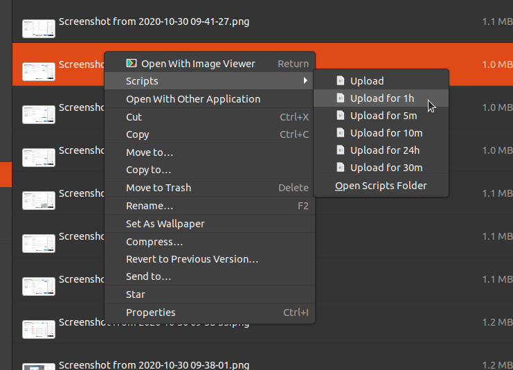

# Upload - Bash script for quick web uploads

An auto-uploader via SSH to a web URL for Linux, OSX, and WSL.

## Usage
```
Setup
=====
export UPLOAD_SSH="server:/path"             # The SSH server/path from '~/.ssh/config' to upload to
export UPLOAD_WEB="https://server.com/path"  # The web host where the files will be found
export UPLOAD_FOLDER="/path"                 # The local path to use for 'upload latest'

Options
=======
  -l        | --latest       # Upload the latest file in the UPLOAD_FOLDER directory
  -f <file> | --file <file>  # Upload a specific file
  -s        | --shell        # Open a shell on the SSH server in the upload folder for cleanup
  -m <#>    | --minutes <#>  # Optional: Specify the number of minutes before the file is deleted from the server
  -y        | --yes          # Optional: Automatically answer Yes to the confirmation question
  -c        | --clipboard    # Optional: Copy the resulting URL to the clipboard
  -h        | --hidden       # Optional: Place in a random subfolder (https://server.com/path/ATg1O352CaiAY0xTGnlv0DtCf03VRpV6/filename.ext)
```

## Example
``` bash
user@host:~$ export UPLOAD_FOLDER=/home/user/Pictures
user@host:~$ export UPLOAD_SSH=linode:/var/www/html/p
user@host:~$ export UPLOAD_WEB=https://mysite.com/p
user@host:~$ 
user@host:~$ upload -l -m 5 -c
Upload '/home/user/Pictures/merged.png'? (y/N): y
merged.png                                                                            100%  464KB   1.9MB/s   00:00    
Setting merged.png to delete in 5 minutes.
Copied to clipboard.
URL: https://mysite.com/p/merged.png
user@host:~$ 
user@host:~$ upload --file Pictures/Screenshot\ from\ 2019-03-27\ 12-22-41.png -m 1 -c
Upload 'Pictures/Screenshot from 2019-03-27 12-22-41.png'? (y/N): y
Screenshot from 2019-03-27 12-22-41.png                                               100% 5880KB   3.5MB/s   00:01    
Setting Screenshot from 2019-03-27 12-22-41.png to delete in 1 minutes.
Copied to clipboard.
URL: https://mysite.com/p/Screenshot%20from%202019-03-27%2012-22-41.png
user@host:~$ 
user@host:~$ UPLOAD_FOLDER=$HOME/Downloads upload -l
Upload '/home/user/Downloads/movie.jpg'? (y/N): n
user@host:~$ 
user@host:~$ upload -s
root@linode:/var/www/html/p# ls
merged.png  Screenshot from 2019-03-27 12-22-41.png
root@linode:/var/www/html/p#
```

## Nautilus scripts
You can copy the files from `nautilus/scripts` into your `~/.local/share/nautilus/scripts` folder to use the upload functionality as a right click option in the system.

However, you must edit the scripts to call the `export` commands above, and the path for `upload`.

